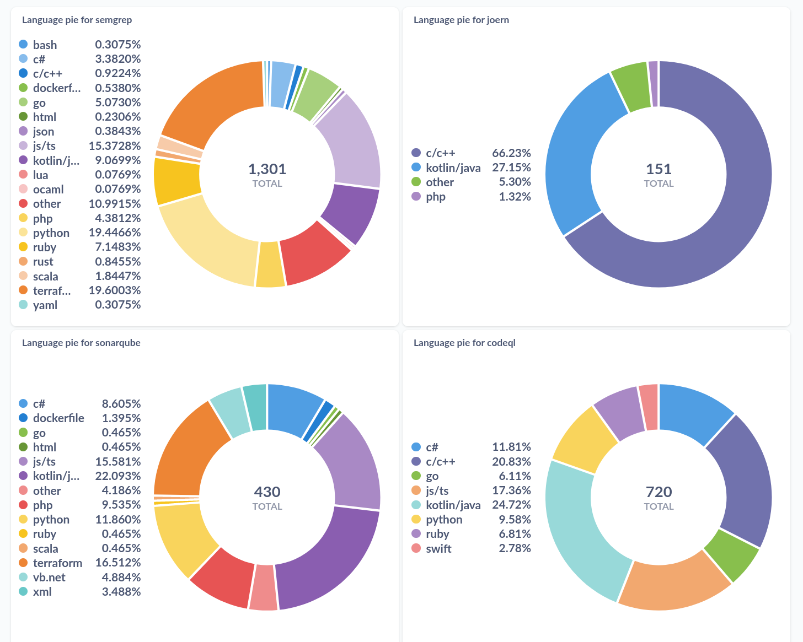
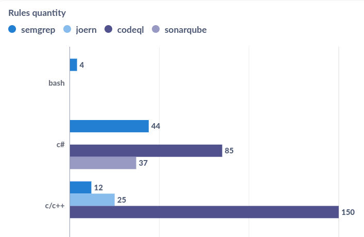
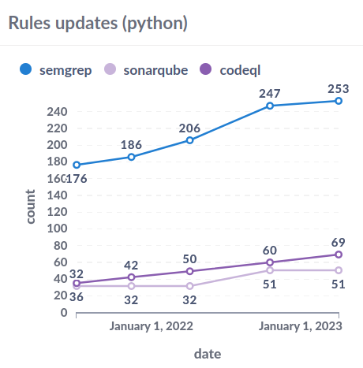

# SAST Metrics Aggregator

This is a simple tool to aggregate SAST rules metrics from multiple sources
into a single database for further more complex analysis.

Currently, it supports the following official sources:
- CodeQL ([codeql](https://github.com/github/codeql))
- Semgrep ([semgrep-rules](https://github.com/returntocorp/semgrep-rules))
- SonarQube ([rspec](https://github.com/SonarSource/rspec)), including Community Edition filters (see [this](src/misc/README.md) for more details)
- Joern ([joern](https://github.com/joernio/joern))

Collected rules are converted into a common format and stored in a PostgreSQL database.  
The following metrics are collected for each rule: identifier, name, description, severity, target technology, CWEs associated (if any), and date for which the rule was fetched.  
Models to store the data are defined in the `src/models.py` file.

## Usage

Configure the database connection in the `config.py` file.
Then, run the following command to fetch the rules from the sources and store them in the database:
```bash
pip install -r requirements.txt
python3 src/comparer.py  # run example client script 
```

## Metrics analysis

The easiest way to analyze the data is to use BI tool such as [Metabase](https://github.com/metabase/metabase/).
After configuring the database connection, create "questions" in Metabase, where you can use "Explore results" to summarize and filter the data as needed.
In order to analyze the data across multiple tables, you can create a "Custom question" and use SQL queries to join the tables.
You can find some example queries in the `src/analysis.sql` file.

## Demo

The following screenshot shows an example of the Metabase dashboard that can be created using the data collected by this tool.





## Adding new sources

To add a new source, create a new class in the `src/gitextractor.py` that inherits from the `GitSecurityRulesRepo` class
and abstracts the logic to fetch the raw rule files from the source.
Then, create a new class in the `src/normalization.py` that inherits from the `RuleConverter` class and abstracts the logic to convert the raw rule files into the common format.
Finally, use the new classes in the `src/comparer.py` script.
